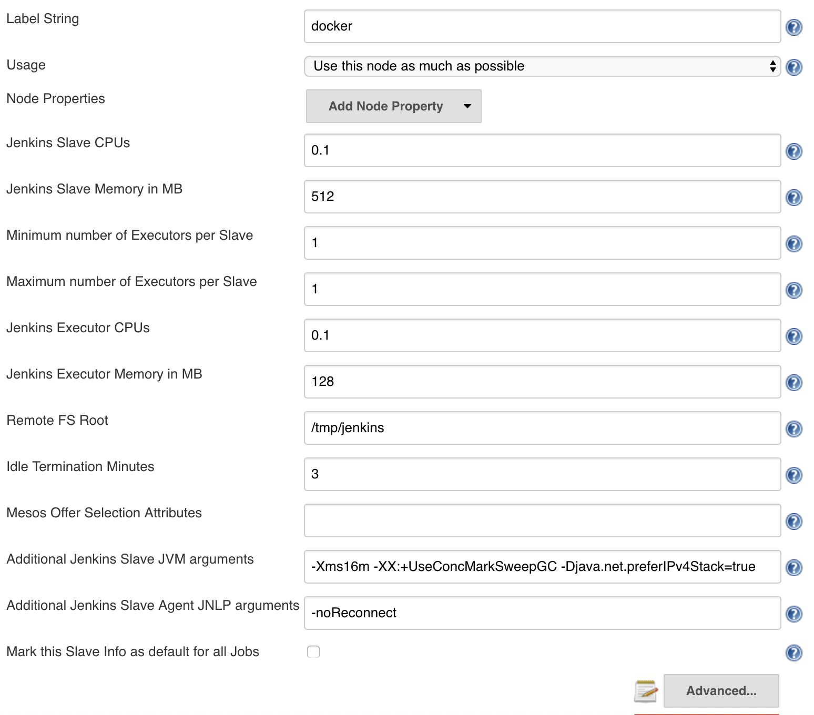
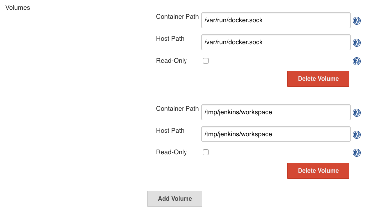

Jenkins running with the Mesos plugin

# Prerequisites

A recent version of [Docker](https://www.docker.com/products/overview) and [Docker Compose](https://docs.docker.com/compose/install/)

* Linux: at least Docker 1.11 and Docker Compose 1.7.1
* Mac: Docker for Mac, which should already include Docker Compose
* Windows: Docker for Windows, which should already include Docker Compose

Particularly should use Docker for Mac and Docker for Windows beta versions (not Docker Toolbox)
as they expose the Docker containers under `localhost` as the Linux version does.

All the examples are using `localhost` for a consistent experience.

Tested with Docker for Mac 1.12.0, 1.13.0 and Docker Compose 1.8.0, 1.9.0

After installation pull all the images using `docker-compose pull` and build our custom Jenkins image with `docker-compose build`

Also pull any images you may want to use as Jenkins build agents, at least

    docker pull csanchez/java-with-docker-client:8-jdk-1.12.3
    docker pull openjdk:8-jdk
    docker pull golang:1.6
    docker pull maven:3.3.9-jdk-8

# Running

To start the cluster run `docker-compose up`

The following services will be started

* Jenkins:  [localhost:8080](http://localhost:8080)
* Mesos:    [localhost:5050](http://localhost:5050)
* Marathon: [localhost:8000](http://localhost:8000)

# Building with Pipeline

Building a Maven project

    node('maven') {
      stage 'Checkout'
      git url: 'https://github.com/sonatype/maven-example-en.git'

      stage 'Build'
      dir('examples/ch-simple/simple') {
        sh "mvn package"
      }
    }

# Building with Pipeline using a different Docker image

The build agent image needs Java (for Jenkins JNLP) and the Docker client. For instance `csanchez/java-with-docker-client:8-jdk-1.12.3`

Create a build agent definition `docker`, and use `/tmp/jenkins` as *Remote FS Root Mount*,
with volumes `/var/run/docker.sock:/var/run/docker.sock` and `/tmp/jenkins/workspace:/tmp/jenkins/workspace`

Example building a golang project

    node('docker') {
        docker.image('golang:1.6').inside {

            stage 'Get sources'
            git url: 'https://github.com/hashicorp/terraform.git', tag: "v0.6.15"

            stage 'Build'
            sh """#!/bin/bash -e
            mkdir -p /go/src/github.com/hashicorp
            ln -s `pwd` /go/src/github.com/hashicorp/terraform
            pushd /go/src/github.com/hashicorp/terraform
            make core-dev plugin-dev PLUGIN=provider-aws
            popd
            cp /go/bin/terraform-provider-aws .
            """

            stage 'Archive'
            archive "terraform-provider-aws"
        }
    }
